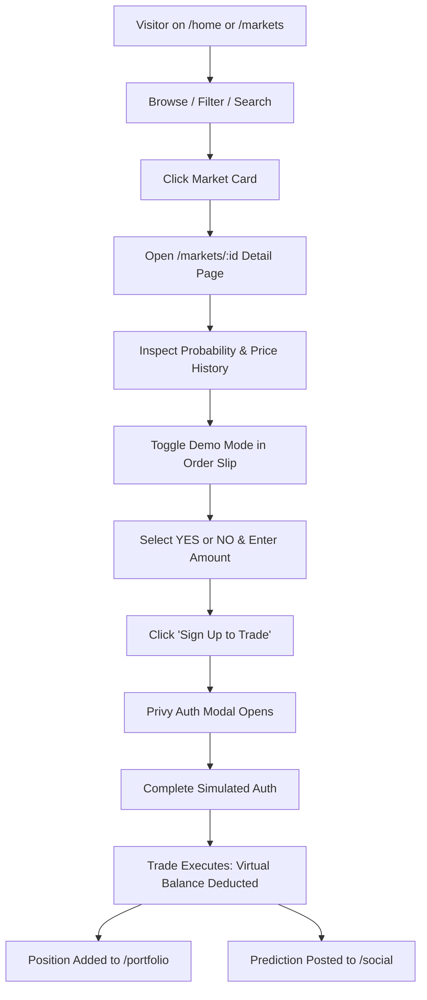
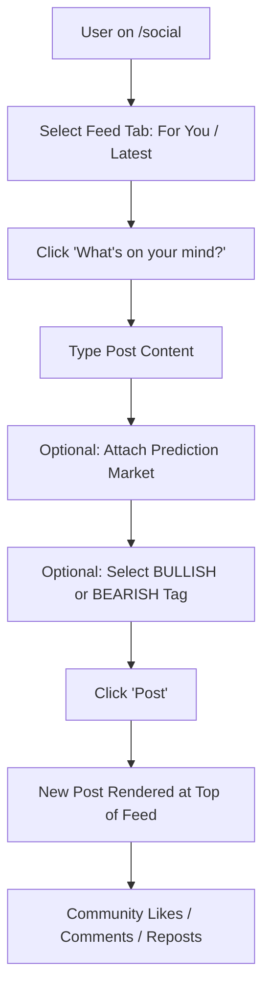
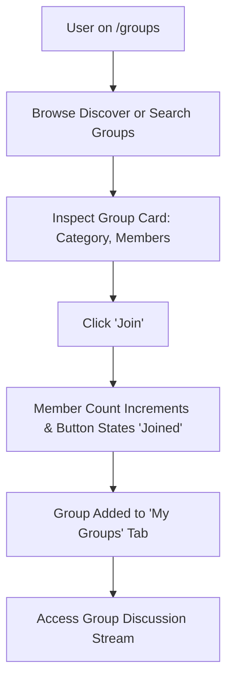

# OmniMarketX User Interaction Flows

Step-by-step documentation of primary user workflows observed on `https://www.omnimarketx.com`.

---

## 1. Flow A: Market Discovery → Practice Trade → Position Tracking

### Steps:
1. **Entry**: User lands on `/markets` or `/home`.
2. **Filtering**: User selects category pill (e.g. `₿ Crypto`) or uses search input.
3. **Selection**: User clicks a market card (e.g., *"Will BNB close above US$3,000 by 31 December 2026?"*).
4. **Analysis**: User reviews the 1W Price History line chart and reads the Resolution Details card.
5. **Configuration**:
   - Toggles segmented control from `Real` to `Demo`.
   - Banner appears: *"DEMO TRADING MODE — TRADING WITH 10,000 USDC IN VIRTUAL FUNDS, NOT REAL MONEY"*.
   - Chooses `YES` (50¢) or `NO` (50¢).
   - Enters `$100` (calculates 200 shares, max payout $200, return +100%).
6. **Execution Gate**:
   - In unauthenticated state, clicking `Sign Up to Trade` triggers the Privy auth dialog.
   - Once authenticated, button changes to `Buy YES Shares`.
7. **Settlement / Feedback**:
   - Virtual balance decreases from 10,000 USDC to 9,900 USDC.
   - Position appears in `/portfolio` positions table.
   - Activity log records the order fill under `/activity`.
   - Event broadcast to `/social` as `🎮 Demo Prediction`.

---

## 2. Flow B: Social Feed → Post Creation → Publication

### Steps:
1. **Entry**: User navigates to `/social` via sidebar.
2. **Browsing**: User views posts under `For You`, filtering through community opinions.
3. **Creation**:
   - Focuses the create post card text area.
   - Clicks `Market` button to open a picker and select an active market card to attach.
   - Assigns a sentiment tag (`BULLISH` or `BEARISH`).
4. **Submission**:
   - Clicks `Post`.
   - New card appears immediately at the top of `Latest` and `For You` streams.
5. **Interaction**:
   - Users can click Like (animating heart and incrementing count), add comments, or repost.

---

## 3. Flow C: Group Discovery → Membership → Topical Discussion

### Steps:
1. **Entry**: User visits `/groups`.
2. **Discovery**: User explores groups in the grid (e.g., *"Entertainment predictions insights"*).
3. **Joining**: Clicks the `Join` button on the card.
4. **State Transition**:
   - Button text changes from `Join` to `Joined` (or checkmark).
   - Member count increments from `29` to `30`.
   - Group appears under the `My Groups` tab.
5. **Engagement**: User clicks into the group to review active discussions and category-specific market predictions.

---

## 4. Flow D: Global Search Navigation

1. **Activation**: User clicks the top header search input or presses the `/` shortcut key.
2. **Query**: User types a term (e.g. `Avengers` or `Bitcoin`).
3. **Live Autocomplete**:
   - A dropdown panel renders with two distinct sections:
     - `MARKETS`: Matching market titles with category icons and probability indicators.
     - `POSTS`: Community posts mentioning the term, showing author initials and snippets.
4. **Navigation**: Clicking any market result routes directly to `/markets/:id`; clicking a post result navigates to `/social`.
